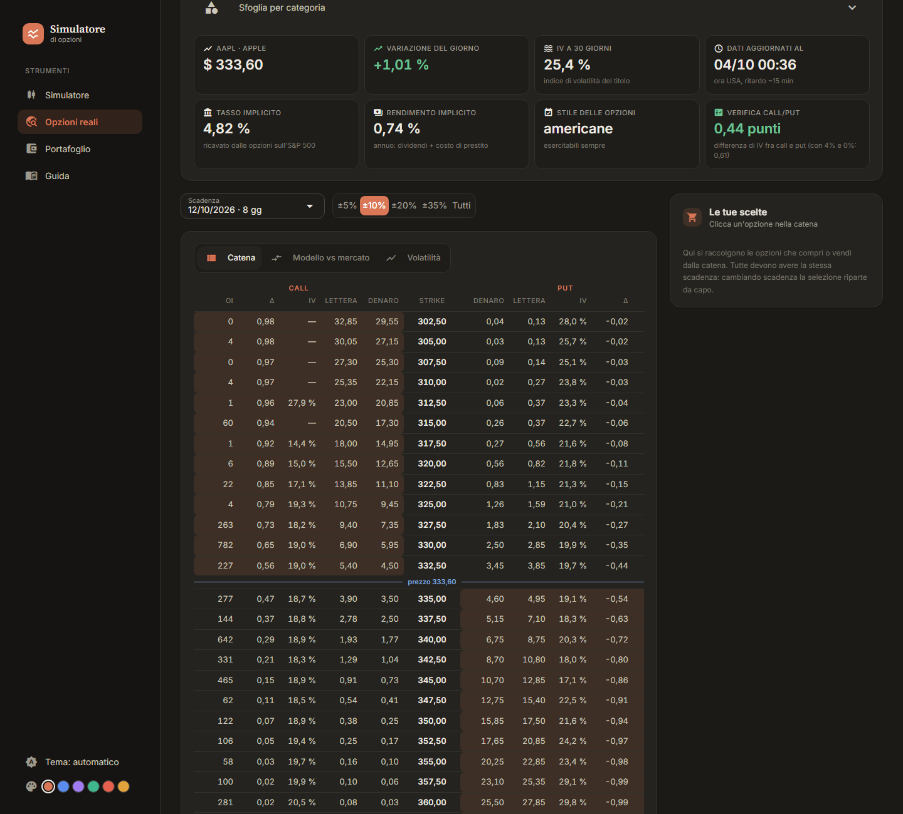
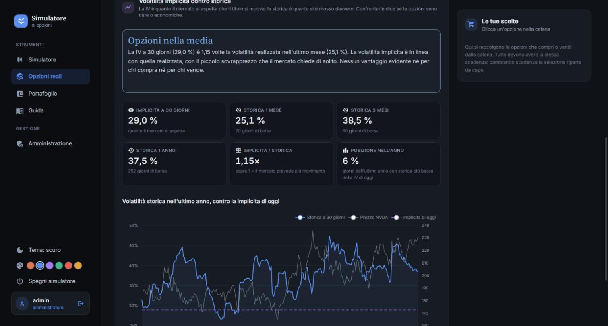

# Simulatore di Opzioni

[](https://github.com/Asrael0/options-simulator/actions/workflows/ci.yml)

Un simulatore per capire le opzioni: un motore di pricing in Python puro (Black-Scholes-Merton,
albero binomiale CRR, greche, payoff multi-gamba) e un'interfaccia web che lo collega alle **opzioni
reali** quotate su CBOE, con un portafoglio virtuale per mettere alla prova le previsioni. Verificato
da 147 test.


> **Nota sui prezzi.** I prezzi sono _teorici_: i modelli assumono volatilità costante e assenza
> di salti di prezzo (gap), quindi divergono dai prezzi reali di mercato. Il simulatore serve a
> capire le relazioni tra le variabili, non a stimare prezzi di trading, e **non costituisce
> consulenza finanziaria**.

---

## Cosa fa

- **Simulatore** — costruisci una posizione (o scegli fra 11 strategie pronte) e guarda come
  reagisce a prezzo, tempo e volatilità: grafico del payoff, curva «fra N giorni» con animazione,
  greche, probabilità di profitto, mappa P&L prezzo × tempo, simulatore di scenari con la
  scomposizione del risultato fra prezzo, tempo e volatilità.
- **Opzioni reali** — la catena di qualunque titolo, ETF o indice USA, da CBOE (ritardo di 15
  minuti): prezzi denaro/lettera, IV, greche. Le opzioni scelte si aprono nel simulatore con prezzi
  veri. Tasso e dividendo vengono ricavati dalle opzioni stesse con la put-call parity.
- **Modello contro mercato** — il modello con una sola volatilità accanto ai prezzi veri: si vede
  il sorriso della volatilità.
- **Care o economiche?** — la volatilità implicita contro quella storica (1 mese, 3 mesi, 1 anno).
- **Portafoglio virtuale** — apri posizioni «per finta» ai prezzi veri, seguile giorno per giorno e
  confronta la probabilità prevista dal modello con come sono andate davvero.
- **Posizioni salvate**, esportazione in JSON, grafico in PNG, riepilogo stampabile in PDF.
- Tema chiaro, scuro o automatico e sei colori principali a scelta.

|  |  |
| :---: | :---: |
| La catena delle opzioni reali | Volatilità implicita contro storica |

---

## Avviare l'applicazione

Serve [uv](https://docs.astral.sh/uv/): installa da solo Python 3.14 e le dipendenze la prima
volta.

```bash
uv run options-simulator
```

Si apre il browser su `http://localhost:8080`. Per fermarla, `Ctrl+C` nel terminale.

Su Windows basta un doppio clic su `Avvia simulatore.bat`: avvia il server senza finestra (o, se
è già acceso, apre solo il browser). Per spegnerlo usa «Spegni simulatore» nella barra laterale
(visibile agli amministratori).

| Comando                     | Cosa fa                                    |
| --------------------------- | ------------------------------------------ |
| `uv run options-simulator` | Avvia l'interfaccia                        |
| `uv run pytest`             | Esegue i 147 test (nessuno usa internet)   |
| `uv run mypy src tests`     | Controlla i tipi in modalità strict        |
| `uv run ruff check .`       | Lint                                       |
| `uv run ruff format .`      | Formatta il codice                         |

---

## Le pagine

| Pagina                           | Cosa contiene                                                       |
| -------------------------------- | ------------------------------------------------------------------- |
| **Simulatore** (`/`)             | Mercato, strategie e posizioni salvate; riepilogo, grafico, schede  |
| **Opzioni reali** (`/mercato`)   | Catena, modello contro mercato, volatilità; carrello delle opzioni  |
| **Portafoglio** (`/portafoglio`) | Posizioni virtuali ai prezzi veri e previsioni contro realtà        |
| **Guida** (`/guida`)             | Ogni aspetto spiegato, dallo strike ai limiti del modello           |
| **Il tuo account**               | Posizioni salvate, cambio password                                  |
| **Amministrazione**              | Solo per amministratori: server, utenti, sessioni, cache            |
| **Stampa** (`/stampa`)           | Riepilogo della posizione da salvare in PDF                         |

Le schede sotto il grafico del simulatore:

| Scheda        | Cosa contiene                                                           |
| ------------- | ----------------------------------------------------------------------- |
| **Gambe**     | Il costruttore della posizione, riga per riga                           |
| **Greche**    | Delta, gamma, theta, vega, rho aggregate, ognuna spiegata               |
| **Scenari**   | Prezzo, data e IV a scelta: P&L, scomposizione e matrice degli scenari  |
| **Mappa P&L** | Guadagno o perdita al variare di prezzo e giorni                        |
| **Costi**     | Moltiplicatore, pacchetti, esborso reale gamba per gamba                |
| **Legenda**   | Come si legge il grafico di payoff                                      |

---

## Dati di mercato

Le opzioni reali e lo storico dei prezzi vengono dagli indirizzi pubblici di
[CBOE](https://www.cboe.com/) usati dal suo sito: dati **in ritardo di circa 15 minuti**, solo
per strumenti USA, per uso personale e di studio. Non sono un servizio garantito: se CBOE cambia
formato, la pagina mostra un errore chiaro invece di rompersi. Il programma scarica un titolo
alla volta e tiene i dati in memoria per qualche minuto, per non fare troppe richieste.

Tutto il resto (account, posizioni salvate, portafoglio) resta sul tuo computer, in
`~/.options-simulator/`.

---

## Account

Al primo avvio viene creato un account amministratore: nome utente **`admin`**, password
**`admin`**. Chiunque può registrarne di nuovi dalla pagina di registrazione; i nuovi account
sono utenti normali e non vedono la pagina di amministrazione.

Le password non sono mai salvate in chiaro. Il file `~/.options-simulator/users.json` contiene
solo il risultato di `pbkdf2_hmac` con 600.000 iterazioni e un sale casuale diverso per ogni
utente. Il confronto usa `hmac.compare_digest`, che impiega sempre lo stesso tempo: un `==`
normale esce al primo byte diverso, e dal tempo di risposta si potrebbe ricostruire l'hash un
byte alla volta.

> **La password `admin` va cambiata se esponi l'app.** Il server ascolta solo su `127.0.0.1`,
> quindi di default è raggiungibile solo da questo computer. Se cambi `host` in `main.py` per
> renderla visibile sulla rete, cambia prima quella password dalla pagina «Il tuo account».
> L'app te lo ricorda a schermo finché resta quella predefinita.

---

## Struttura

```
src/options_simulator/
  pricing/             Motore: Python puro, ZERO dipendenze dall'interfaccia
    types.py           Dataclass, Literal, convenzioni di unità
    normal.py          N(x) e phi(x) ad alta precisione, vettorizzate
    black_scholes.py   Formule chiuse per le europee
    binomial.py        Albero CRR vettorizzato con NumPy
    implied.py         Volatilità implicita dal prezzo (bisezione)
    greeks.py          Dispatch, cache, greche di posizione
    payoff.py          P&L multi-gamba, break-even, estremi, costo, probabilità
  app/                 Interfaccia NiceGUI
    auth.py            Account, hashing delle password, sessioni
    session.py         Posizione per utente, condivisa fra le pagine
    state.py           Stato della posizione, valori derivati, scenari, mappa
    context.py         Ricalcolo unico + registro dei pannelli
    panels/            I pannelli del simulatore, uno per file
    layout.py          Barra laterale, titolo pagina, nota sui prezzi
    widgets.py         Elementi visivi condivisi, ricerca dei titoli
    theme.py           Tema chiaro/scuro, colori principali, caratteri
    chart.py           Grafico di payoff e mappa P&L (ECharts)
    saved.py           Posizioni salvate, esportazione e importazione
    market_data.py     Catena delle opzioni reali da CBOE
    carry.py           Tasso e dividendo ricavati con la put-call parity
    volatility.py      Volatilità storica contro implicita
    portfolio.py       Portafoglio virtuale ai prezzi veri
    tickers.py         Catalogo dei titoli, scrittura unica dei simboli
    strategies.py      Strategie precostruite
    formatting.py      Numeri e date in stile italiano
    pages/             Una funzione per rotta (market/ divisa per schede)
    main.py            Avvio del server
tests/                 147 test, nessuno usa internet
docs/
  GUIDA-AL-CODICE.md   Mappa dei file e dei concetti Python, per chi inizia
```

La dipendenza va in una direzione sola: `app` importa `pricing`, mai il contrario. Il motore
resta testabile in isolamento, usabile da un notebook Jupyter e riutilizzabile da qualunque
altro frontend.

---

## Come funziona l'interfaccia

NiceGUI è un framework **server-side**: il codice Python gira sul server, il browser mostra il
risultato, e i due si parlano via WebSocket. Quando muovi uno slider il browser manda l'evento
al Python, il Python ricalcola e rimanda solo ciò che è cambiato.

Per questo si scrive come Python normale: non esiste un "componente" con un ciclo di vita da
imparare, esistono funzioni che disegnano. Il pattern è tutto qui:

1. `@ui.page("/percorso")` registra una rotta. La funzione viene rieseguita **da capo a ogni
   visita**.
2. Proprio per questo lo stato della posizione **non** vive dentro la pagina: vivrebbe per una
   sola visita, e tornando dalla «Guida» al simulatore ripartirebbe dai valori iniziali. Sta in
   `session.py`, indicizzato per sessione del browser.
3. I pannelli sono `@ui.refreshable` registrati in un `PageContext`, che ricalcola le analytics
   **una volta** e poi aggiorna tutto ciò che è registrato.

Il punto 3 è la ragione per cui il pricing non sta dentro i setter dello stato: così si vede a
colpo d'occhio quante volte per interazione viene ricalcolato.

Gli slider sono **throttled** a 80 ms: senza, un trascinamento produrrebbe decine di eventi al
secondo, e in modalità americana ognuno costruisce alberi binomiali. `trailing_events` garantisce
che l'ultimo valore arrivi comunque, quindi non si perde la posizione finale del cursore.

### Premi congelati

Il pannello «Strategie» ha un interruttore, attivo di default: **i premi restano fissati a quando
hai aperto la posizione**. Muovendo lo spot vedi cambiare il valore della posizione, non il costo
che hai già pagato — che è ciò che un diagramma di payoff deve insegnare.

Quando il mercato corrente si allontana dallo snapshot, compare un avviso che riporta i valori a
cui i premi sono fissati. Serve: senza, un premio calcolato a spot 100 mentre gli slider mostrano
115 sembrerebbe semplicemente sbagliato.

Disattivando l'interruttore si ottiene il comportamento del prototipo originale: i premi
inseguono i parametri correnti, e la curva «valore oggi» passa sempre per lo zero al prezzo spot.

---

## Convenzioni di unità

Sono la fonte più probabile di errori, quindi vivono nei **nomi**, non nei commenti:

- Tassi e volatilità sono **sempre decimali**. IV 30% ⇒ `0.30`. La percentuale esiste solo dove
  si mostrano i numeri all'utente.
- Il motore lavora **per unità di sottostante**. `qty` è un moltiplicatore puro; il
  moltiplicatore di contratto e il numero di pacchetti entrano soltanto in `trade_cost()`.
- `theta_per_day` è in valuta **al giorno**; `vega_per_point` e `rho_per_point` sono per **+1
  punto** (cioè +0.01 decimale). Non per anno e non per +1.00.

---

## Scelte di Python che vale la pena riconoscere

Il codice è commentato anche dal punto di vista del linguaggio, non solo della finanza. I punti
principali:

**`@dataclass(frozen=True, slots=True)`** — `frozen` rende gli oggetti immutabili: una gamba non
può cambiare sotto i piedi a chi la sta usando, e per modificarla si usa `dataclasses.replace()`,
che ne restituisce una copia. `slots` elimina il dizionario di istanza: meno memoria e accessi
più rapidi.

**Union discriminata con `match`** — `Leg = OptionLeg | StockLeg`, e il codice la distingue con
il pattern matching strutturale di Python 3.10+:

```python
match leg:
    case StockLeg():
        return final_spot
    case OptionLeg(right="call", strike=strike):
        return max(final_spot - strike, 0.0)
    case OptionLeg(strike=strike):
        return max(strike - final_spot, 0.0)
```

Rispetto a una catena di `isinstance` legge meglio, permette di destrutturare i campi dentro il
pattern, e mypy restringe i tipi ramo per ramo. Il prezzo di carico dell'azione si chiama
`entry_price`, non `strike`: non è uno strike travestito e non entra in nessuna formula.

**`Literal["call", "put"]` invece di `Enum`** — i valori sono già stringhe parlanti, e mypy
verifica comunque che non se ne usino altre. Attenzione a una trappola: `EUROPEAN = "european"`
viene inferito come `str` generico e non è più accettato dove serve un `Literal`. Serve
l'annotazione esplicita: `EUROPEAN: ExerciseStyle = "european"`.

**`functools.lru_cache` sulla dataclass** — funziona perché `OptionSpec` è `frozen`, quindi
hashabile: i parametri **sono** la chiave, senza doverla costruire a mano concatenando stringhe.

**`itertools.pairwise`** — per confrontare ogni elemento col precedente. `zip(xs, xs[1:])` fa lo
stesso ma è più rumoroso, e con `strict=True` è addirittura un errore, perché le due sequenze
hanno lunghezze diverse per costruzione.

**mypy in modalità strict** — è l'equivalente Python di `"strict": true` in TypeScript. Non è
obbligatorio in Python, ma su codice numerico dove `theta` per anno e `theta` per giorno sono
entrambi `float`, i tipi sono l'unica rete di sicurezza che resta.

---

## Perché NumPy non è un opzionale

Un albero binomiale a N passi ha O(N²) nodi. Con N = 140 sono circa diecimila valutazioni: in
JavaScript un doppio ciclo le esegue in frazioni di millisecondo, **in Python puro sarebbe circa
cento volte più lento**.

La soluzione non è "scrivere Python più veloce" ma cambiare la forma del calcolo: un intero
_livello_ dell'albero diventa un array, e l'induzione all'indietro diventa **una** operazione
vettoriale per livello. Si passa da O(N²) iterazioni interpretate a O(N) chiamate NumPy, ognuna
eseguita in C.

La riga che fa tutto il lavoro è questa:

```python
val = discount * (p_up * val[:-1] + p_down * val[1:])
```

`val[:-1]` sono i figli "su", `val[1:]` i figli "giù". Uno slittamento di un indice esprime
l'intera struttura ad albero. È il modo di pensare che NumPy richiede, e vale la pena
interiorizzarlo: quasi tutto il calcolo numerico in Python funziona così.

---

## Verifica

147 test. Quelli del motore coprono la tabella di riferimento — prezzi ATM, greche, put-call
parity, convergenza binomiale, premio di esercizio anticipato, bear put spread, iron condor,
collar, costo dell'operazione — più robustezza su `T = 0`, `IV → 0`, strike lontani dallo spot,
quantità elevate, spot nullo, scadenze decennali.

Alcuni test valgono più di un controllo numerico:

- **Simmetria di `norm_cdf`.** `N(x) + N(−x) = 1` a precisione macchina _per costruzione_: è
  questa proprietà, non l'accuratezza, a rendere esatta la put-call parity.
- **Call americana ≡ europea.** Il confronto è binomiale contro binomiale ed è bit per bit:
  senza dividendi il `max(continuazione, esercizio)` non morde in nessun nodo. Contro
  Black-Scholes resterebbe la discretizzazione e il test fallirebbe a torto.
- **Gamma liscio.** Delta, gamma e theta si leggono dai livelli 1 e 2 dell'albero invece che per
  differenze finite, che dividendo per `h²` amplificano il sawtooth del CRR in un jitter del ~2%.
- **Premio congelato.** `resolve_legs()` risolve i premi **una volta** contro un `MarketParams`
  esplicito: il costo già pagato non cambia quando il mercato si muove.

### Concordanza con la versione TypeScript

Lo stesso motore esiste anche in una seconda implementazione indipendente, in TypeScript
(progetto separato). Le due concordano su ogni valore fino a 1e-6:

| Valore                       | TypeScript            | Python                |
| ---------------------------- | --------------------- | --------------------- |
| Call ATM                     | 3.591123              | 3.591123              |
| Put ATM                      | 3.262896              | 3.262896              |
| Delta / Gamma                | 0.532370 / 0.046232   | 0.532370 / 0.046232   |
| Vega / Theta                 | 0.113996 / −0.062439  | 0.113996 / −0.062439  |
| Binomiale europeo, 500 passi | 3.589410              | 3.589410              |
| Put americana ITM            | 20.000000             | 20.000000             |
| Bear put spread: costo / BE  | 2.862338 / 97.137662  | 2.862338 / 97.137662  |
| Iron condor: credito / ala   | 2.693222 / −7.306778  | 2.693222 / −7.306778  |
| Collar: floor / cap          | −9.385751 / 10.614249 | −9.385751 / 10.614249 |
| Costo operazione, netto      | 1467.9620             | 1467.9620             |

Due implementazioni indipendenti in linguaggi diversi che concordano è l'evidenza più forte
disponibile su un motore finanziario: un errore avrebbe dovuto essere commesso due volte allo
stesso modo.

---

## Stato

Motore completo e verificato; interfaccia con simulatore, opzioni reali, volatilità, portafoglio
virtuale, posizioni salvate ed esportazione. Le posizioni aperte nel simulatore vivono in memoria
finché non le salvi; posizioni salvate e portafoglio restano su disco.

Limiti noti: una sola scadenza per posizione (niente calendar spread), nessuna commissione né
margine, nessun esercizio anticipato nel portafoglio virtuale, dati di mercato solo USA.

### Perché NiceGUI e non un sito statico

I browser eseguono JavaScript e WebAssembly, non Python. Un'interfaccia web in Python ha quindi
due strade:

- **NiceGUI o Reflex** — il Python gira su un server. Serve tenerlo acceso (`uv run options-simulator`), quindi l'app non è distribuibile come cartella di file.
- **Pyodide** — Python compilato in WebAssembly, gira nel browser e resta un sito statico. Ma
  costa 7–12 MB di download e alcuni secondi di avvio a freddo.

Scelto NiceGUI: il codice si legge come Python normale, il che conta più della modalità di
distribuzione per uno strumento che si usa in locale.

---

## Non mettere il progetto in OneDrive (o Dropbox, iCloud…)

`.venv` e la sincronizzazione continua non vanno d'accordo: OneDrive trasforma i file
dell'ambiente virtuale in segnaposto «solo online», e `uv` fallisce con `Accesso negato (os error
5)` o con `trampoline failed to canonicalize script path`. Tieni il progetto in una cartella
normale, per esempio `C:\progetti\`. Se il guaio è già successo: sposta la cartella, cancella
`.venv` e, se serve, `uv cache clean`; al primo `uv run` l'ambiente si ricrea da solo.

---

## Licenza

Progetto privato, **tutti i diritti riservati**: chi lo riceve dall'autore può usarlo per studio
personale, ma non ridistribuirlo né pubblicarlo. I dettagli sono in [LICENSE](LICENSE).
