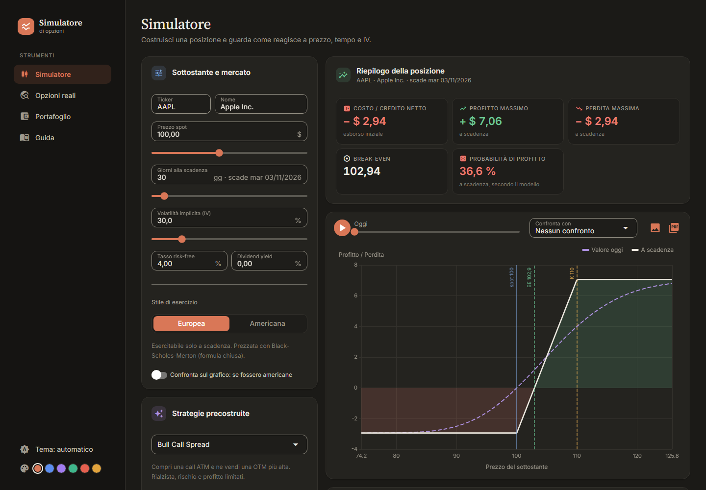
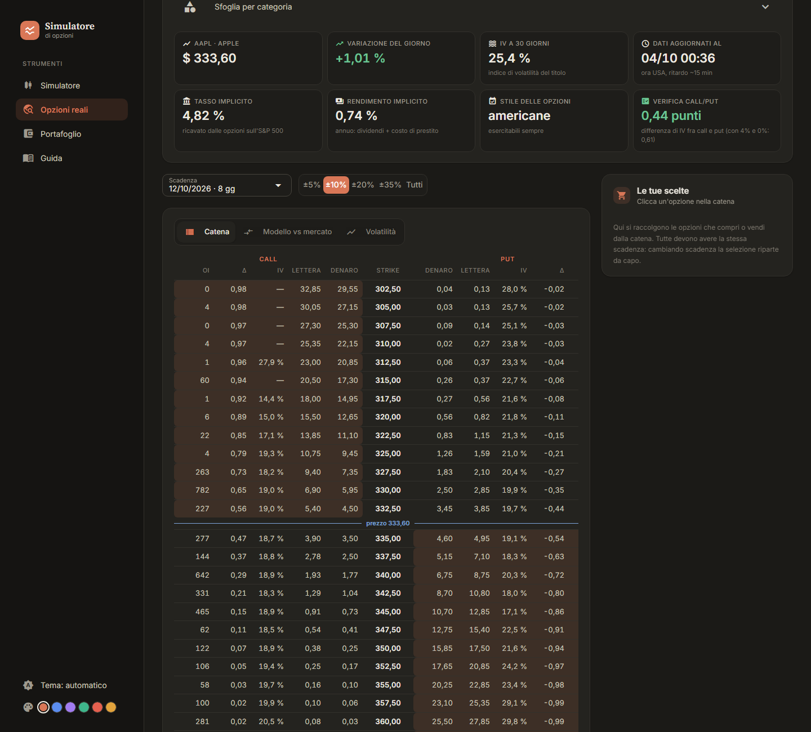

# Options Simulator

[](https://github.com/Asrael0/options-simulator/actions/workflows/ci.yml)

A simulator for understanding options: a pricing engine in pure Python (Black-Scholes-Merton,
CRR binomial tree, Greeks, multi-leg payoff) and a web interface that connects it to the **real
options** listed on CBOE, with a virtual portfolio to put forecasts to the test. Covered by 157
tests. The interface is available in **English and Italian**.



> **A note on prices.** Prices are _theoretical_: the models assume constant volatility and no
> price jumps (gaps), so they differ from real market prices. The simulator is for understanding
> how the variables relate, not for estimating trading prices, and **it is not financial
> advice**.

---

## What it does

- **Simulator** — build a position (or pick one of 11 ready-made strategies) and watch how it
  reacts to price, time and volatility: payoff chart, animated «in N days» curve, Greeks,
  probability of profit, price × time P&L map, and a scenario simulator that splits the result
  into price, time and volatility.
- **Real options** — the chain of any US stock, ETF or index, from CBOE (15-minute delay): bid/ask
  prices, IV, Greeks. Picked options open in the simulator with real prices. Rate and dividend are
  derived from the options themselves through put-call parity.
- **Model vs market** — the single-volatility model next to the real prices: the volatility smile
  becomes visible.
- **Expensive or cheap?** — implied volatility against historical volatility (1 month, 3 months,
  1 year).
- **Virtual portfolio** — open make-believe positions at real prices, follow them day by day and
  compare the probability the model predicted with how they actually turned out.
- **Saved positions**, JSON export, PNG chart, printable PDF summary.
- **Settings** — language (English or Italian), light, dark or automatic theme, and six accent
  colours.

|  |  |
| :---: | :---: |
| The real options chain | Implied against historical volatility |

---

## Running the application

You need [uv](https://docs.astral.sh/uv/): the first time it installs Python 3.14 and the
dependencies by itself.

```bash
uv run options-simulator
```

The browser opens on `http://localhost:8080`. To stop it, press `Ctrl+C` in the terminal.

On Windows, just double-click `start-simulator.bat`: it starts the server without a window (or,
if it is already running, only opens the browser). To shut it down use «Shut down simulator» in
the sidebar (visible to administrators).

| Command                    | What it does                              |
| -------------------------- | ----------------------------------------- |
| `uv run options-simulator` | Starts the interface                      |
| `uv run pytest`            | Runs the 157 tests (none uses internet)   |
| `uv run mypy src tests`    | Type-checks in strict mode                |
| `uv run ruff check .`      | Lint                                      |
| `uv run ruff format .`     | Formats the code                          |

---

## Pages

| Page                              | What it contains                                                  |
| --------------------------------- | ----------------------------------------------------------------- |
| **Simulator** (`/`)               | Market, strategies and saved positions; summary, chart, tabs      |
| **Real options** (`/market`)     | Chain, model vs market, volatility; basket of picked options      |
| **Portfolio** (`/portfolio`)    | Virtual positions at real prices, forecasts against reality       |
| **Guide** (`/guide`)              | Every aspect explained, from the strike to the model's limits     |
| **Settings** (`/settings`)    | Language, theme and colour, saved positions, password change      |
| **Administration** (`/admin`)     | Administrators only: server, users, sessions, cache               |
| **Print** (`/print`)             | Position summary to save as PDF                                   |

The tabs under the simulator chart:

| Tab         | What it contains                                                         |
| ----------- | ------------------------------------------------------------------------ |
| **Legs**    | The position builder, row by row                                         |
| **Greeks**  | Aggregate delta, gamma, theta, vega and rho, each one explained          |
| **Scenarios** | Price, date and IV of your choice: P&L, breakdown and scenario matrix  |
| **P&L map** | Gain or loss as price and days change                                    |
| **Costs**   | Multiplier, packages, real outlay leg by leg                             |
| **Legend**  | How to read the payoff chart                                             |

---

## Language

The language is chosen on the **Settings** page (or with the IT/EN switch on the login page) and
is remembered by the browser. Every visible text goes through `tr()` in
`src/options_simulator/app/i18n.py`: the Italian sentence in the code is the key, and
`lang_en.py` holds the English version. A test checks that every sentence passed to `tr()` has
its translation and that the placeholders match. The user guide has a full English version in
`pages/guide_en.py`. In English, numbers and dates use the English format (`1,234.56`,
`12 Oct 2026`).

---

## Market data

Real options and price history come from the public [CBOE](https://www.cboe.com/) endpoints used
by its website: data **delayed by about 15 minutes**, US instruments only, for personal and study
use. It is not a guaranteed service: if CBOE changes the format, the page shows a clear error
instead of breaking. The program downloads one stock at a time and keeps data in memory for a few
minutes, to avoid making too many requests.

Everything else (accounts, saved positions, portfolio) stays on your computer, in
`~/.options-simulator/`.

---

## Accounts

On first start an administrator account is created: username **`admin`**, password **`admin`**.
Anyone can register new accounts from the sign-up page; new accounts are normal users and do not
see the administration page.

Passwords are never stored in plain text. The file `~/.options-simulator/users.json` holds only
the result of `pbkdf2_hmac` with 600,000 iterations and a different random salt for each user.
The comparison uses `hmac.compare_digest`, which always takes the same time: a plain `==` stops at
the first different byte, and the response time could be used to rebuild the hash one byte at a
time.

> **Change the `admin` password if you expose the app.** The server listens only on `127.0.0.1`,
> so by default it is reachable only from this computer. If you change `host` in `main.py` to make
> it visible on the network, first change that password from the Settings page. The app reminds
> you on screen as long as the default one is in use.

---

## Structure

```
src/options_simulator/
  pricing/             Engine: pure Python, ZERO dependencies on the interface
    types.py           Dataclasses, Literals, unit conventions
    normal.py          High-precision, vectorised N(x) and phi(x)
    black_scholes.py   Closed formulas for European options
    binomial.py        CRR tree vectorised with NumPy
    implied.py         Implied volatility from price (bisection)
    greeks.py          Dispatch, cache, position Greeks
    payoff.py          Multi-leg P&L, break-evens, extremes, cost, probability
  app/                 NiceGUI interface
    auth.py            Accounts, password hashing, sessions
    session.py         Per-user position, shared across pages
    state.py           Position state, derived values, scenarios, map
    context.py         Single recompute + panel registry
    panels/            The simulator panels, one per file
    layout.py          Sidebar, page title, price notice
    widgets.py         Shared visual elements, stock search
    theme.py           Light/dark theme, accent colours, fonts
    i18n.py            Language choice and the tr() / trn() functions
    lang_en.py         English translations
    chart.py           Payoff chart and P&L map (ECharts)
    saved.py           Saved positions, export and import
    market_data.py     Real options chain from CBOE
    carry.py           Rate and dividend derived through put-call parity
    volatility.py      Historical against implied volatility
    portfolio.py       Virtual portfolio at real prices
    tickers.py         Stock catalogue, one spelling for every symbol
    strategies.py      Prebuilt strategies
    formatting.py      Numbers and dates in the chosen language
    pages/             One function per route (market/ split by tab)
    main.py            Server start-up
tests/                 157 tests, none uses internet
docs/
  CODE-GUIDE.md        Map of the files, reading order, where to change things
```

Dependencies go one way only: `app` imports `pricing`, never the reverse. The engine stays
testable in isolation, usable from a Jupyter notebook and reusable by any other frontend.

---

## How the interface works

NiceGUI is a **server-side** framework: the Python code runs on the server, the browser shows the
result, and the two talk over a WebSocket. When you move a slider the browser sends the event to
Python, Python recomputes and sends back only what changed.

That is why it reads like normal Python: there is no "component" with a lifecycle to learn, just
functions that draw. The whole pattern is this:

1. `@ui.page("/path")` registers a route. The function runs **from scratch on every visit**.
2. Precisely for that reason the position state does **not** live inside the page: it would last
   a single visit, and going from the «Guide» back to the simulator would reset it. It lives in
   `session.py`, keyed by browser session.
3. Panels are `@ui.refreshable` functions registered in a `PageContext`, which recomputes the
   analytics **once** and then refreshes everything registered.

Point 3 is why pricing does not sit inside the state setters: this way you can see at a glance how
many times it is recomputed per interaction.

Sliders are **throttled** to 80 ms: without it, a drag would produce dozens of events per second,
and in American mode each one builds binomial trees. `trailing_events` guarantees that the last
value still arrives, so the final slider position is never lost.

### Frozen premiums

The «Strategies» panel has a switch, on by default: **premiums stay fixed at the moment you
opened the position**. Moving spot changes the value of the position, not the cost you already
paid — which is what a payoff diagram should teach.

When the current market drifts away from the snapshot, a notice shows the values the premiums are
fixed at. It is needed: without it, a premium computed at spot 100 while the sliders show 115
would simply look wrong.

Turning the switch off gives the original prototype's behaviour: premiums follow the current
parameters, and the «value today» curve always crosses zero at the spot price.

---

## Unit conventions

They are the most likely source of bugs, so they live in the **names**, not in comments:

- Rates and volatilities are **always decimals**. IV 30% ⇒ `0.30`. Percentages exist only where
  numbers are shown to the user.
- The engine works **per unit of underlying**. `qty` is a pure multiplier; the contract
  multiplier and the number of packages only enter in `trade_cost()`.
- `theta_per_day` is in currency **per day**; `vega_per_point` and `rho_per_point` are per **+1
  point** (i.e. +0.01 decimal). Not per year and not per +1.00.

---

## Python choices worth recognising

The main points:

**`@dataclass(frozen=True, slots=True)`** — `frozen` makes objects immutable: a leg cannot change
under the feet of whoever is using it, and to modify it you use `dataclasses.replace()`, which
returns a copy. `slots` removes the instance dictionary: less memory and faster access.

**Discriminated union with `match`** — `Leg = OptionLeg | StockLeg`, and the code tells them apart
with the structural pattern matching of Python 3.10+:

```python
match leg:
    case StockLeg():
        return final_spot
    case OptionLeg(right="call", strike=strike):
        return max(final_spot - strike, 0.0)
    case OptionLeg(strike=strike):
        return max(strike - final_spot, 0.0)
```

Compared with a chain of `isinstance` it reads better, lets you destructure fields inside the
pattern, and mypy narrows the types branch by branch. The stock's entry price is called
`entry_price`, not `strike`: it is not a strike in disguise and it enters no formula.

**`Literal["call", "put"]` instead of `Enum`** — the values are already meaningful strings, and
mypy still checks that no others are used. Beware of one trap: `EUROPEAN = "european"` is
inferred as a generic `str` and is no longer accepted where a `Literal` is required. It needs the
explicit annotation: `EUROPEAN: ExerciseStyle = "european"`.

**`functools.lru_cache` on the dataclass** — it works because `OptionSpec` is `frozen`, hence
hashable: the parameters **are** the key, with no need to build it by hand by joining strings.

**`itertools.pairwise`** — to compare each element with the previous one. `zip(xs, xs[1:])` does
the same but is noisier, and with `strict=True` it is actually an error, because the two sequences
have different lengths by construction.

**mypy in strict mode** — the Python equivalent of `"strict": true` in TypeScript. It is not
mandatory in Python, but in numerical code where `theta` per year and `theta` per day are both
`float`, types are the only safety net left.

---

## Why NumPy is not optional

A binomial tree with N steps has O(N²) nodes. With N = 140 that is about ten thousand
evaluations: in JavaScript a double loop runs them in a fraction of a millisecond, **in pure
Python it would be about a hundred times slower**.

The fix is not "writing faster Python" but changing the shape of the calculation: a whole _level_
of the tree becomes an array, and backward induction becomes **one** vector operation per level.
You go from O(N²) interpreted iterations to O(N) NumPy calls, each one executed in C.

The line that does all the work is this one:

```python
val = discount * (p_up * val[:-1] + p_down * val[1:])
```

`val[:-1]` are the "up" children, `val[1:]` the "down" children. A one-index shift expresses the
whole tree structure. It is the way of thinking NumPy asks for, and worth internalising: almost all
numerical computing in Python works like this.

---

## Verification

157 tests. The engine tests cover the reference table — ATM prices, Greeks, put-call parity,
binomial convergence, early-exercise premium, bear put spread, iron condor, collar, trade cost —
plus robustness on `T = 0`, `IV → 0`, strikes far from spot, large quantities, zero spot and
ten-year expiries. Other tests cover saved positions, the portfolio, market data parsing,
volatility, the ticker catalogue and the translations.

Some tests are worth more than a numerical check:

- **`norm_cdf` symmetry.** `N(x) + N(−x) = 1` to machine precision _by construction_: it is this
  property, not accuracy, that makes put-call parity exact.
- **American call ≡ European.** The comparison is binomial against binomial and bit for bit:
  without dividends `max(continuation, exercise)` never bites at any node. Against Black-Scholes
  the discretisation would remain and the test would fail wrongly.
- **Smooth gamma.** Delta, gamma and theta are read from levels 1 and 2 of the tree instead of by
  finite differences, which, dividing by `h²`, amplify the CRR sawtooth into a ~2% jitter.
- **Frozen premium.** `resolve_legs()` resolves premiums **once** against an explicit
  `MarketParams`: the cost already paid does not change when the market moves.

### Agreement with the TypeScript version

The same engine also exists as a second, independent implementation in TypeScript (separate
project). The two agree on every value to 1e-6:

| Value                        | TypeScript            | Python                |
| ---------------------------- | --------------------- | --------------------- |
| ATM call                     | 3.591123              | 3.591123              |
| ATM put                      | 3.262896              | 3.262896              |
| Delta / Gamma                | 0.532370 / 0.046232   | 0.532370 / 0.046232   |
| Vega / Theta                 | 0.113996 / −0.062439  | 0.113996 / −0.062439  |
| European binomial, 500 steps | 3.589410              | 3.589410              |
| ITM American put             | 20.000000             | 20.000000             |
| Bear put spread: cost / BE   | 2.862338 / 97.137662  | 2.862338 / 97.137662  |
| Iron condor: credit / wing   | 2.693222 / −7.306778  | 2.693222 / −7.306778  |
| Collar: floor / cap          | −9.385751 / 10.614249 | −9.385751 / 10.614249 |
| Trade cost, net              | 1467.9620             | 1467.9620             |

Two independent implementations in different languages that agree are the strongest evidence
available on a financial engine: a bug would have had to be made twice, in the same way.

---

## Status

Engine complete and verified; interface with simulator, real options, volatility, virtual
portfolio, saved positions, export and two languages. Positions opened in the simulator live in
memory until you save them; saved positions and the portfolio stay on disk.

Known limits: one expiry per position (no calendar spreads), no commissions or margin, no early
exercise in the virtual portfolio, US market data only.

### Why NiceGUI and not a static site

Browsers run JavaScript and WebAssembly, not Python. A web interface in Python therefore has two
paths:

- **NiceGUI or Reflex** — Python runs on a server. It has to stay on
  (`uv run options-simulator`), so the app cannot be shipped as a folder of files.
- **Pyodide** — Python compiled to WebAssembly, runs in the browser and stays a static site. But
  it costs a 7–12 MB download and a few seconds of cold start.

NiceGUI was chosen: the code reads like normal Python, which matters more than the distribution
model for a tool used locally.

---

## Do not keep the project in OneDrive (or Dropbox, iCloud…)

`.venv` and continuous syncing do not get along: OneDrive turns the virtual environment's files
into «online-only» placeholders, and `uv` fails with `Access denied (os error 5)` or with
`trampoline failed to canonicalize script path`. Keep the project in a normal folder, for example
`C:\progetti\`. If it already happened: move the folder, delete `.venv` and, if needed, run
`uv cache clean`; on the next `uv run` the environment is rebuilt by itself.

---

## License

Private project, **all rights reserved**: whoever receives it from the author may use it for
personal study, but may not redistribute or publish it. Details are in [LICENSE](LICENSE).
